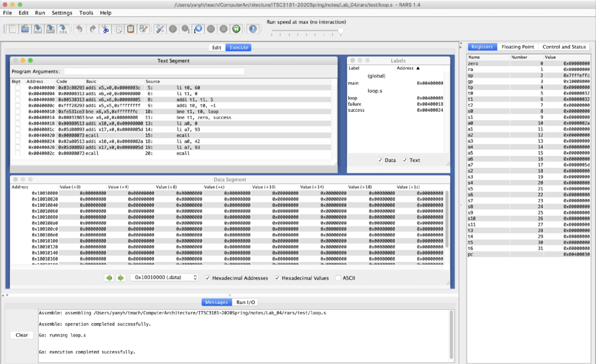

```s
 .globl main
.text
main:
	# Tests simple looping behaviour
	li t0, 60
	li t1, 0
loop:
	addi t1, t1, 5
	addi t0, t0, -1
	bne t1, t0, loop  
	bne t1, zero, success
failure:
	li a0, 0
	li a7, 93 
	ecall
success:
	li a0, 42 
	li a7, 93
	ecall
```

## PART 1  
Convert and execute the loop.s file from the RARS repo in the test folder.
1. Download or copy-paste the [source file](https://raw.githubusercontent.com/TheThirdOne/rars/master/test/loop.s) and open it with RARS.
2. Convert the loop.s program to a C program that does the same as loop.s.
	- You can execute the C program at [Repl.it](https://repl.it/languages/c) or use the VM you configured earlier.
	- Check [Environment Calls](https://github.com/TheThirdOne/rars/wiki/Environment-Calls) to understand the `ecall` instruction used in the loop.s file. For this program, `ecall` is just a `return <code>` call in C.
3. Assemble and run the loop.s program in RARS. See the screenshot below.
	- Check the address, binary code, instructions and source of the assembled code, and also check the register values and memory values (data segment part) of the program execution.
	- After you run the program multiple times, you should run step-by-step, i.e., instruction by instruction and observe the change of values in registers and other locations.
	- During the step-by-step simulation in RARS, do the simulation in your mind of the corresponding C program to understand how high-level language programs are actually executed by a computer.
	- To see the Labels window, go to the Settings menu and select “Show Labels Window (symbols table).”

	<div style="text-align:center;"></div>

```c
int main(void){
    int a = 60;
    int i = 0;
    while (i != a) {
        i += 5;
        a -= 1;
    }
    if (i == 0) return 0;
	else return 42;
}
```


## PART 2
Implement a program to accumulate the integer numbers from 1 to 100 using RISC-V assembly, and simulate the assembly program execution using RARS. You should have already implemented a C program for this task in a previous lab.
1. Using the loop.s program as a starting point, program 1-100 integer accumulation using RISC-V assembly. While the instructions we learned during the class should be sufficient to do the work, you can check RARS [supported instructions](https://github.com/TheThirdOne/rars/wiki/Supported-Instructions) and use them.
2. To print the result and return the result, your program should make an environment call `PrintInt`, check [Environment Calls](https://github.com/TheThirdOne/rars/wiki/Environment-Calls).

```s
 .globl main
.text
main:
	# Tests simple looping behaviour
	li t0, 0				# sum = 0
	li t1, 0				# i = 0
loop:
	addi t1, t1, 5			# i++ 
	add t0, t0, t1			# a += i
	bne t1, t0, loop  		# if i != a, go to loop
	bne t1, zero, success	# if i == 0, go to success
failure:
	li a0, 0
	li a7, 93 
	ecall
success:
	li a0, 42 
	li a7, 93
	ecall
```

## PART 3

## PART 4